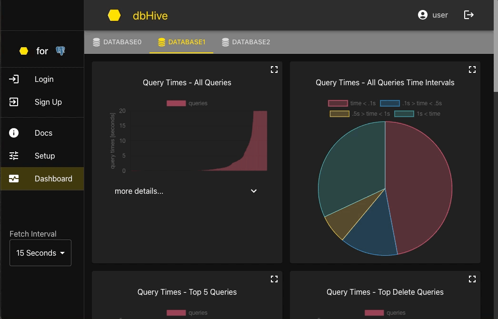
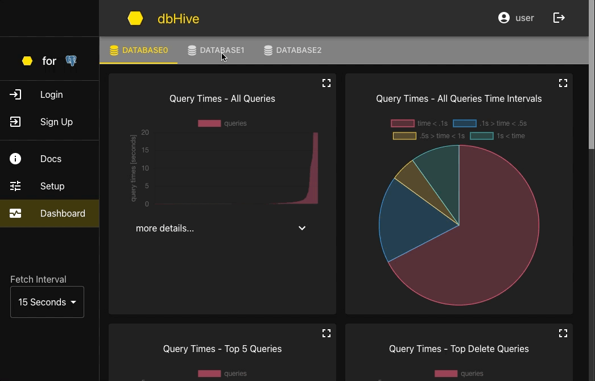

<p align="center">

</p>

<h1 align="center">Welcome to dbHive! 🐝</h1>
<h3 align="center">PostgreSQL Monitoring Tool</h3>
<br>

# Table of Contents

- [About](#about)
- [Getting Started](#getting-started)
- [Features](#features)
- [Troubleshooting](#troubleshooting)
- [Contributing](#contributing)

# About

dbHive offers an interactive dashboard to visualize the performance of one or more PostgreSQL databases. By providing easily accessible information about the health and activity of a database, dbHive enables developers to make informed decisions that optimize the way they store their data.

# Getting Started

### https://dbhive.net/

# Features

### ➮ Query Execution Times

Get a broad sense of database performance by viewing average query times across the database, as well as averages for specific types of SQL queries. Pinpoint the slowest queries to gain insight for database improvement.

###



### ➮ Most Frequent Queries

To analyze common and recurring database activity, view charts on the most frequent queries within and across all query types.

### ➮ Other Key Stats

At a glance, gather other vital information, including:

- conflicts
- deadlocks
- rolled back transactions
- cache hit ratio
- block hits
- and more

### ➮ Access everything with a secure account

Maintain privacy and security with dbHive's required secure login. All database information and metrics are protected with encrypted accounts.

### ➮ Connect one or more databases

Easily access all databases and metrics within one place with the ability to toggle between multiple database dashboards.

###



### ➮ Customize database metrics dashboard

Use dropdowns to view more details on a given metric. Expand graphs to fill the screen. Adjust the fetch interval, the frequency at which the dashboard is updated with the latest metrics.

### ➮ Delete a database

Navigate to the Setup page and remove a database when it is no longer in use, keeping your dashboard clean.

# Privacy and Security

dbHive does not store any user data, most importantly including database connection information, usernames, and passwords. Data is kept encrypted on the client.

# Troubleshooting

If certain database metrics are shown as unavailable in the dashboard, database user permissions may need to be elevated. Necessary user permissions and admin privileges can vary depending on the database hosting service used.
For issues with application accounts, it is recommended to remove problematic users. Follow the directions in the "Remove application users" section of this readme.

### ➮ Shared library

If you receive this error, <em>'error: pg_stat_statements must be loaded via shared_preload_libraries'</em>, in **postgresql.conf** change

```
shared_preload_libraries = ''
```

to

```
shared_preload_libraries = 'pg_stat_statements'
```

and restart the Postgres service.

# Contributing

Read our [contribution guide](https://github.com/oslabs-beta/dbhive/blob/main/CONTRIBUTING.md) for more information on how to contribute to dbHive.

### Development Mode

If you would like to participate in developing new features, the app can be launched in development mode:

```
npm run dev
```

or

```
docker build -t dbhive/main-dev -f Dockerfile-dev .
```

```
docker-compose -f docker-compose-dev-hot.yml up
```

# Future Enhancements

- **Search Feature:** Add a search bar to the dashboard that allows users to find data by keywords.
- **Expansion to Other Databases:** Make dbHive available for other databases besides PostgreSQL.
- **Comparing Schemas:** Allow users to compare the performance of alternate database schemas alongside their current schemas.
- **Additional Customization:** Give users more power to customize graphs and dashboard arrangement.

### Authors

- Melanie Forbes [GitHub](https://github.com/mforbz12) | [LinkedIn](https://www.linkedin.com/in/melanie-forbes-/)
- Elise McConnell [GitHub](https://github.com/enmcco) | [LinkedIn](https://www.linkedin.com/in/elisemcconnell/)
- Brandon Miller [GitHub](https://github.com/bmiller1881) | [LinkedIn](https://www.linkedin.com/in/brandon-j-miller/)
- Emily Paine [GitHub](https://github.com/erpaine) | [LinkedIn](https://www.linkedin.com/in/emily-paine1/)
- Jeffery Richardson [GitHub](https://github.com/jrichardson-rn) | [LinkedIn](https://www.linkedin.com/in/jeffery-richardson-ii-2ba819100/)
